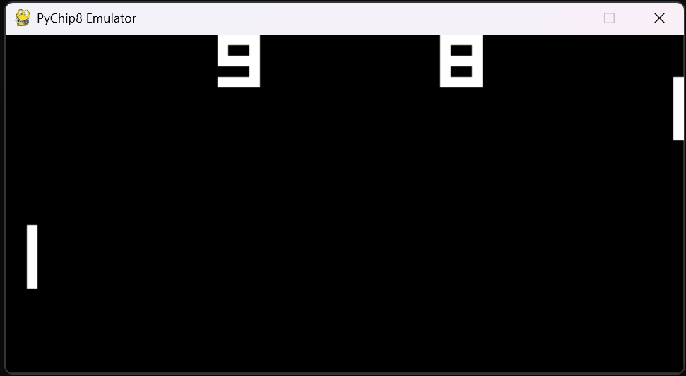

# CHIP-8 Emulator (Python + Pygame)

## English

This is a CHIP-8 emulator built with Python, focused on simplicity, readability, and extensibility.
It currently uses `pygame` for rendering, keyboard input, and audio.



### Features

- CHIP-8 core components: `memory`, `V` registers, `I`, `pc`, stack, and timers
- 64x32 monochrome display (`core/Display.py`)
- Keyboard mapping to the 16-key CHIP-8 keypad (`core/input.py`)
- Common opcodes implemented (expandable)
- Basic beep sound support (`beep.mp3`)

### Project Structure

```text
CHIP-8/
  core/
    CPU.py
    Display.py
    input.py
  play.py
  beep.mp3
  README.md
```

### Requirements

- Python 3.10+
- `pygame`

### Quick Start

```CMD
git clone https://github.com/chen-hub986/PyCHIP-8.git
cd PyCHIP-8
pip install pygame
python play.py [rom_path]
```

ROM reference:
https://www.zophar.net/pdroms/chip8.html
### Controls

Current key layout (`core/input.py`):

```text
1 2 3 4
Q W E R
A S D F
Z X C V
```

### Known Limitations

- Opcode compatibility is still being expanded
- ~~No built-in ROM picker or CLI options yet~~
- Speed/FPS tuning is currently development-oriented

### License

MIT License

## 繁體中文

這是一個使用 Python 開發的 CHIP-8 模擬器，重點是簡潔、可讀性高、易於擴充。
目前使用 `pygame` 做顯示、鍵盤輸入與音效。


### 功能特色

- CHIP-8 核心元件：`memory`、`V` 寄存器、`I`、`pc`、stack、timers
- 64x32 單色顯示（`core/Display.py`）
- 鍵盤映射到 16 鍵 CHIP-8 keypad（`core/input.py`）
- 已實作常見 opcode（可持續擴充）
- 基本蜂鳴音支援（`beep.mp3`）

### 專案結構

```text
CHIP-8/
  core/
    CPU.py
    Display.py
    input.py
  play.py
  beep.mp3
  README.md
```

### 環境需求

- Python 3.10+
- `pygame`

### 快速開始

```CMD
git clone https://github.com/chen-hub986/PyCHIP-8.git
cd PyCHIP-8
pip install pygame
python play.py [rom_path]
```

ROM 來源參考：
https://www.zophar.net/pdroms/chip8.html

### 操作鍵位

目前鍵位布局（`core/input.py`）：

```text
1 2 3 4
Q W E R
A S D F
Z X C V
```

### 已知限制

- opcode 相容性仍在持續補齊
- ~~尚無內建 ROM 選擇器或 CLI 選項~~
- 速度與幀率調校目前偏開發導向

### 授權

MIT License

